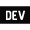

# Hey! 

  Hi, I'm Alex. 😄
   
  <i>Welcome to my GitHub profile!</i>
    
  I'm an aspiring web developer from Melbourne, Australia. 🦘

I enjoy experimenting with new technologies by building small projects and am interested in front-end architecture. I like to learn about how things work and the many different ways we can build a project.

 

  
More About Me...

   

🌱 I’m currently self-learning front-end web development and am really enjoying it!

👷‍♂️ I’ve been working on a website for a side gig. 💪 Exciting, I know!

🤙 When I'm bored, I like to play around with my [dotfiles](https://github.com/ioalex/dotfiles).

 

<i>Let's connect! ☎️</i>
  

 

 

---

 

## Technologies

---

## Recent Activity

  
Show

   

<!--START_SECTION:activity-->

1. 💪 Opened PR [#572](https://github.com/anuraghazra/github-readme-stats/pull/572) in [anuraghazra/github-readme-stats](https://github.com/anuraghazra/github-readme-stats)
2. 🎉 Merged PR [#1](https://github.com/ioalex/vanilla-parcel-boilerplate/pull/1) in [ioalex/vanilla-parcel-boilerplate](https://github.com/ioalex/vanilla-parcel-boilerplate)
3. 🎉 Merged PR [#1](https://github.com/ioalex/sass-gulp-experiment/pull/1) in [ioalex/sass-gulp-experiment](https://github.com/ioalex/sass-gulp-experiment)
4. 🎉 Merged PR [#1](https://github.com/ioalex/strapi-test/pull/1) in [ioalex/strapi-test](https://github.com/ioalex/strapi-test)
<!--END_SECTION:activity-->

  

<!-- ATTRIBUTION -->
<!-- <a href="https://icons8.com/icon/63807/website">Website icon by Icons8</a> -->
